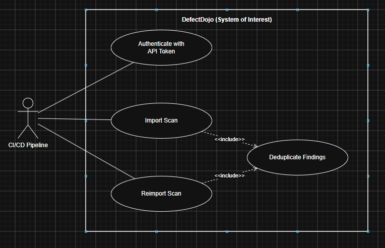
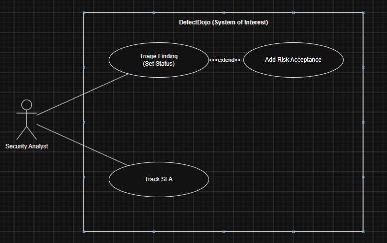
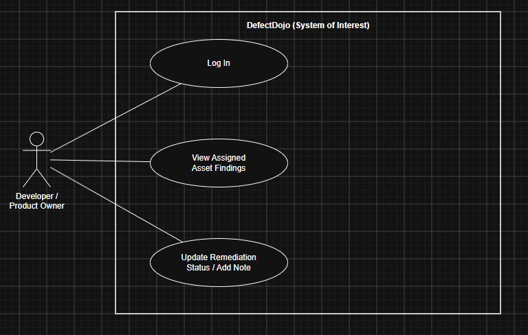
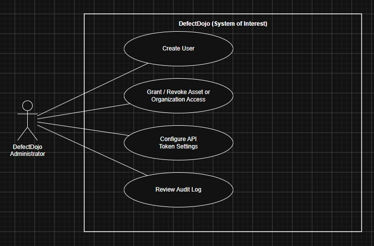
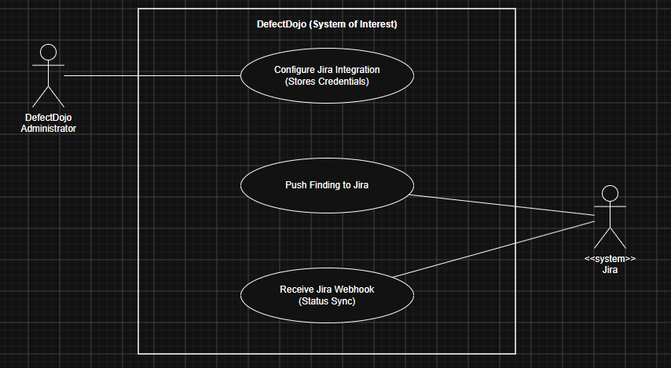
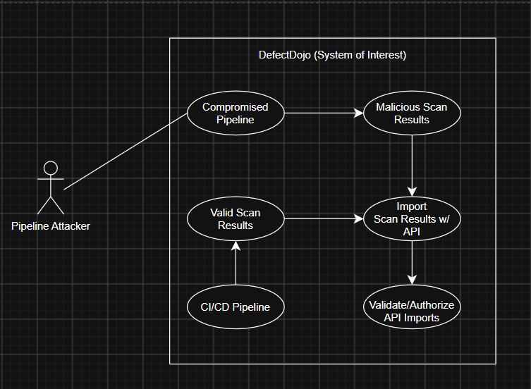
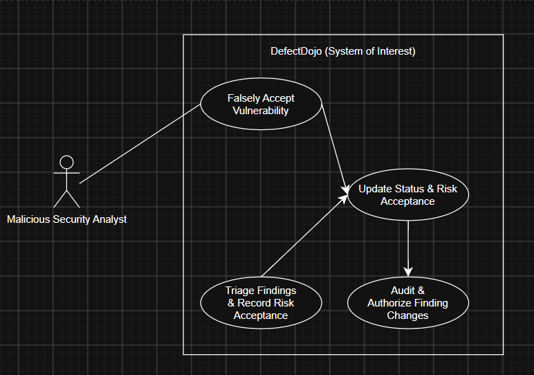
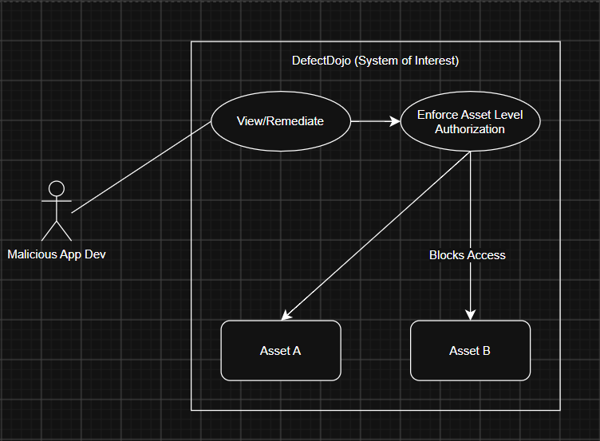
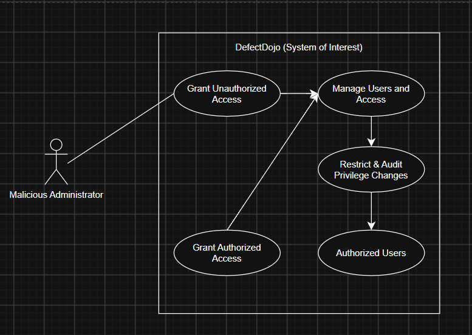
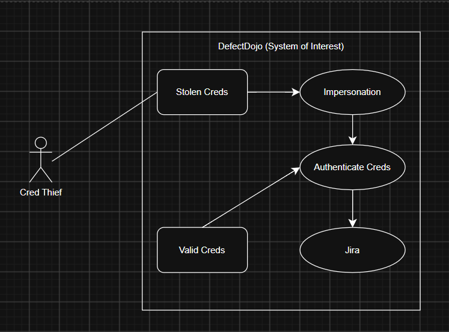

# Requirements for Software Security Engineering

**Team 5**

| Member | Role |
|---|---|
| Ray Donner | Contributor |
| Grant Nichter | Team Lead |
| Alex Bahwawsi | Contributor |
| Chandler Crist | Contributor |

**Team GitHub Repository:** [github.com/creepysmilejpg/SWADjangoProject](https://github.com/creepysmilejpg/SWADjangoProject)

Task assignments, discussion, and progress tracking for this project are managed through the repository's GitHub Project Board, where issues are linked to board cards and closed only after review/comment.

---

# Part 1
## 1. The Five Essential Interactions of Defectdojo.

**1. CI/CD pipline imports scan results through the API**

This is how nearly all data enters DefectDojo. Reports can be uploaded either directly through the UI or through an API endpoint that allows automated ingestion. API calls authenticate with a header containing the user's API key. In the open-source edition, auto-creating the Organization/Asset/Engagement/Test context during import is only available through the API; UI imports need the hierarchy to exist first. That means a pipeline token can create structure, not just findings, which is a useful point for the misuse cases.

---
**2. Security analyst triages findings and records risk acceptance**

This is the core decision workflow, and it is exactly what your "integrity compromise" threat targets. Besides active states, a finding can be marked Duplicate, Mitigated, False Positive, Out Of Scope, Risk Accepted, or Under Defect Review. Risk Acceptances can carry uploaded files and notes as justification, and they have expiry dates that force re-evaluation. Each Asset can have its own SLA configuration, which sets the number of days allowed to remediate a finding.

---
**3. Developer or product owner views and remediates findings for their own asset**

This interaction carries your "cross-application disclosure" threat (App A's developer seeing App B), and that threat maps to DefectDojo's authorization boundary. An Asset's Authorized Users list grants access to that Asset and everything nested beneath it, while an Organization's list cascades to every Asset underneath. Open source now offers only local username/password login plus the password-reset flow.

---
**4. DefectDojo administrator manages users and access**

This maps to your "privilege escalation" threat. Superuser and staff accounts can see and act on every Asset and Organization regardless of the Authorized Users lists, and only those accounts get the controls to change the lists. The first account on a fresh install is automatically a superuser. Admins can also harden the API surface: API tokens can be turned off entirely with DD_API_TOKENS_ENABLED=False, or only the api-token-auth endpoint can be disabled with DD_API_TOKEN_AUTH_ENDPOINT_ENABLED=False.

---
**5. DefectDojo pushes findings to Jira**

This is the one interaction where DefectDojo holds another system's credentials and accepts inbound calls, so it carries your "credential theft" threat. The integration is gated by a System Settings toggle; while it is off, DefectDojo won't push findings (including push_to_jira API requests) and ignores incoming Jira webhooks. The troubleshooting page gives the open-source path as Configuration > System Settings > Enable JIRA integration, and notes that pushes run asynchronously. Those asynchronous pushes run on your Celery Workers box.

---

## 2. For each use case, derive security requirements using misuse case analysis.

**1. Injection of Malicious Information**

A pipeline attacker could be someone who obtained a DefectDojo API key belonging to a CI/CD pipeline. The API key allows the pipeline to authenticate to DefectDojo. The attacker in questions can then make requests that appear legtimate. This could include modifying the information being imported, creating unauthorized application structures, or submitting fabricated information.

**Security requirement:** Validate/Authorize API Imports
DefectDojo should validate imported scan results and ensure that the API requests being made are authorized according to the permissions of the account that are associated with that API key. API activity should also be logged so administrators can identify which account made the request.

---

**2. Falsely Accepting Vulnerabilities**

A malicious security analyst would be someone who is a authenticated user and has legitimate access to vulnerability findings, but intentionally misues that access to mislead others on the current risks. This scenario works as an insider threat, where the analyst compromises the integrity of vulnerability information. They can prevent the proper remediation from taking place, leading to real security issues being left unchecked.

**Security requirement:** Audit Finding Changes
DefectDojo should restrict security sensitive finding changes to authorized users and maintain an audit of changes to finding status and risk acceptance. The system should record who made the change and when. Risk acceptances should retain their expiration information so that accepted vulnerabilities can be re-evaluated when the acceptance expires.

---
**3. Access Another Application's Findings**

A malicious application developer is a legitimate developer who has access to one application in DefectDojo but attempts to access information belonging to another. If this is successful, this can expose vulnerability information belonging to another application and potentially allow them to modify or remediate findings they are not responsible for.

**Security requirement:** Asset Level Authorization
DefectDojo should verify a user is authorized to access an asset before providing access to its resources. These checks can apply to both the user interface and API requests so that a user can't bypass the application's authorization boundary.

---
**4. Grant Unauthorized Access**

A compromised administrator is an attacker who has obtained control of a superuser account. These accounts have greater access than normal users, and can manage authorized users, access rights, etc. The attacker can add themselves or another account to an asset, create unauthorized privileged access, or even modify existing access controls to view application data.

**Security requirement:** Restrict and Audit Privilege Changes
DefectDojo should restrict user and access management functions to authorized administrators and maintain an audit trail of changes to user permissions and authorized user lists. Administrator privilege assignments should require appropriate authorization and they should be able to disable API token functionality when not required to reduce attack surface.

---
**5. Use Stolen Jira Credentials**

A credential thief is an attacker who obtains credentials used by DefectDojo to communicate with Jira. DefectDojo stores these credentials and communicates with Jira asynchronously through the integration. The attacker can potentially use these credentials outside of DefectDojo to access or manipulate information in Jira.

**Security requirement:** Protect and Authenticate Integration Credentials
DefectDojo should protect Jira integration credentials from unauthorized access and restrict changes to the integration configuration to authorized administrators. Jira webhook requests should be authenticated before they are processed and integration activity should be logged so unauthorized requests or changes can be identified.

---

## 3. Iterate between use and misuse cases.

The following is a prompt we utilized to both assist in both the creation and reviewal of our diagram: 

---

## 4. Build a list of security requirements derived from misuse case analysis.

---

## 5. Assess the alignment of security requirements

---
# Part 2
## 1. Review your OSS project documentation specifically for security-related configuration and installation issues. Summarize your observations about what could be improved or is missing.
